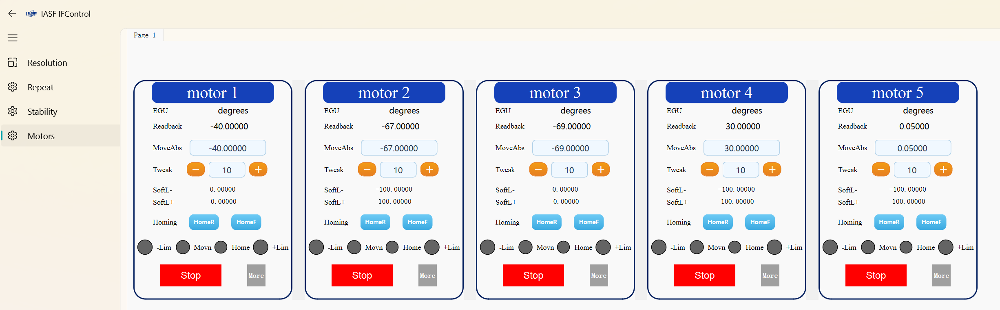
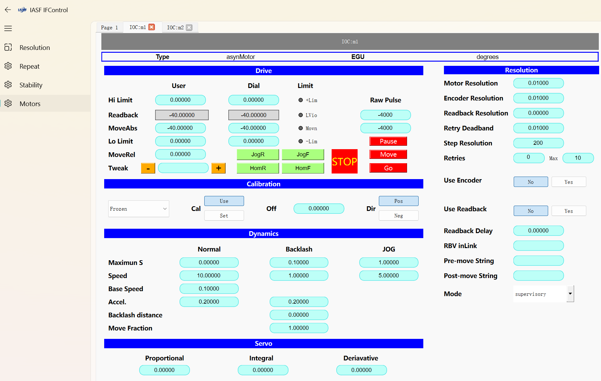

# PyDM 电机控制界面运行指南

## 运行界面预览

### 多电机控制中心界面

主界面采用网格布局展示多个电机控制卡片，每个卡片包含电机的基本控制功能：

- 电机描述和单位显示
- 当前位置反馈
- 绝对移动设置
- 微调控制（+/-按钮）
- 软限位设置
- 回零控制（HomeR/HomeF）
- 状态指示器（限位、移动中、回零状态）
- 急停按钮和更多设置入口

界面支持水平滚动以查看更多电机卡片，便于集中监控和操作多个电机设备。

### 电机详细配置界面

点击电机卡片上的「More」按钮可打开详细配置界面，包含以下高级功能：

- 电机类型和单位设置
- 用户/刻度盘/限位值显示
- 绝对/相对移动控制
- 回零和点动操作
- 校准设置
- 动态参数配置（速度、加速度等）
- 伺服参数调整（比例、积分、微分）
- 编码器和反馈设置

> **界面截图说明**：
> 
> - 第一张截图展示了多电机控制中心的主界面，水平排列了5个电机控制卡片
>   
>   
> - 第二张截图展示了电机详细配置界面，显示了电机的高级参数设置面板
>   
>   
>   
>   

## 基本运行命令

运行单个电机控制卡片的基本命令格式：

```bash
pydm -m "{\"MOTOR\":\"IOC:m1\"}" motor_card.ui
```

## 命令参数说明

- **`pydm`**: PyDM (Python Display Manager) 的主程序命令
- **`-m`**: 宏参数标志，用于传递变量到UI界面
- **`"{\"MOTOR\":\"IOC:m1\"}"`**: JSON格式的宏参数，定义了`MOTOR`变量的值为`IOC:m1`
  - 注意：Windows系统下需要使用双反斜杠转义JSON中的引号
- **`motor_card.ui`**: 要加载的UI文件路径

## 宏参数解释

在`motor_card.ui`文件中，所有通道都是以`${MOTOR}`作为变量占位符定义的，例如：

- `ca://${MOTOR}.DESC` - 电机描述
- `ca://${MOTOR}.RBV` - 电机当前位置
- `ca://${MOTOR}.VAL` - 电机设定位置

运行命令时，`${MOTOR}`会被替换为实际的PV前缀，如`IOC:m1`，从而连接到正确的EPICS PV通道。

## 多电机控制界面运行

对于多电机控制中心界面，使用以下命令运行：

```bash
python main_motor_ui.py
```

运行后，通过界面中的「配置电机」按钮设置电机数量和各电机的PV变量。

## 注意事项

1. 确保已在conda的pydm环境中运行以上命令
2. 确保EPICS IOC已启动并提供相应的PV变量
3. 替换示例中的`IOC:m1`等为实际的EPICS PV前缀
4. 在Windows命令提示符中，JSON字符串的引号需要使用双反斜杠转义
5. 在PowerShell中，可能需要使用不同的引号转义方式